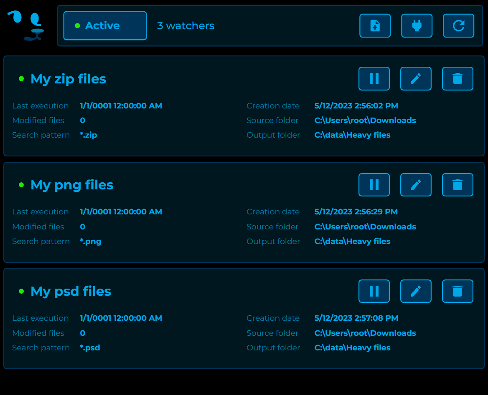
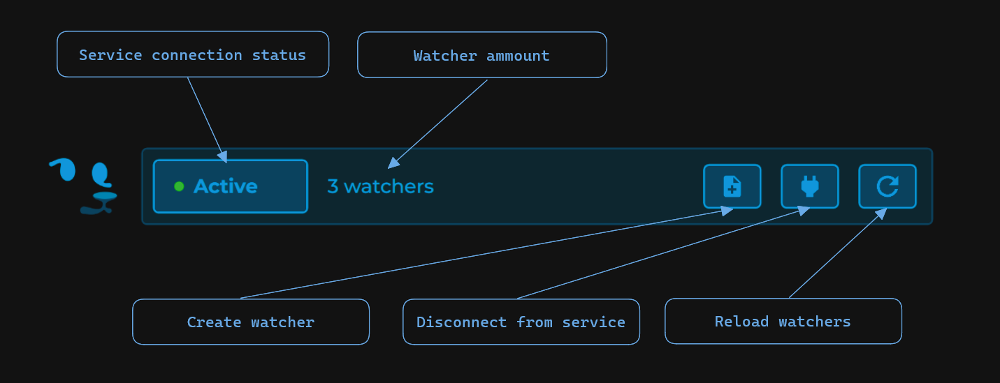
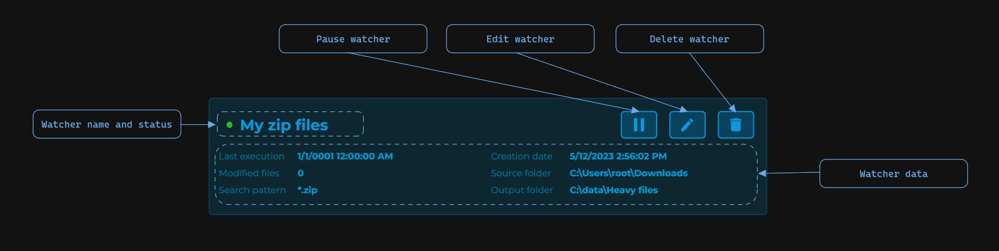
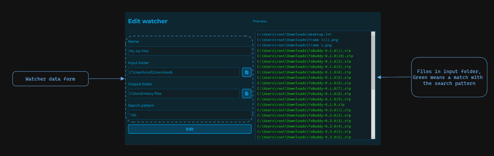

---
| Build                                                                                                                                                   |
|---------------------------------------------------------------------------------------------------------------------------------------------------------|
|  |

An open-source platform for filesystem automation provides a user-friendly graphical user interface (GUI) that is designed to simplify the automation of various filesystem tasks. **Windows only app, Linux on roadmap**.

## Screenshots

## Features
- Subscribe to a directory file changes.
- Set filter by filename.
- Move file on creation and rename.

## Installation

Go to the [Releases](https://github.com/jdaar/FsBuddy/releases) section and download the file **Setup-x64.exe**, then open the file as an Administrator and follow the setup wizard.

## Usage

The following pictures will show you the basic structure of the UI:

### Header

### Watcher list

### Create/Edit

## Roadmap

### Milestones

- [ ] Generic WatcherAction
    - [ ] Allow the watcher to perform a custom action when activated (Javascript VM)
- [ ] Filters
    - [ ] By file size
    - [ ] By content (Javascript VM)
- [ ] File data extraction
    - [ ] Export to csv
- [ ] Add support for Linux

### Features

- [ ] Log visualization from within the app

 
